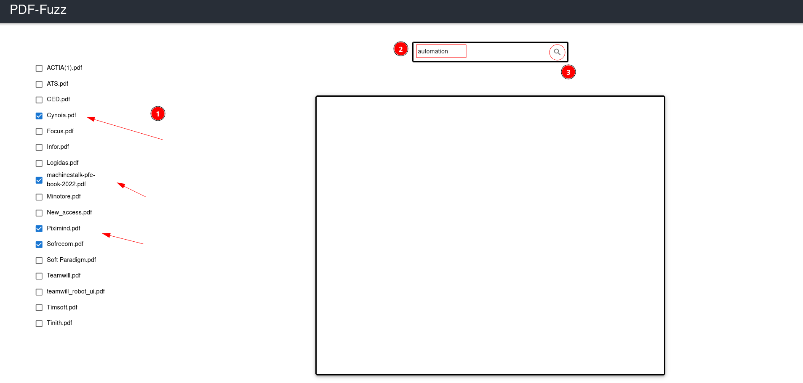
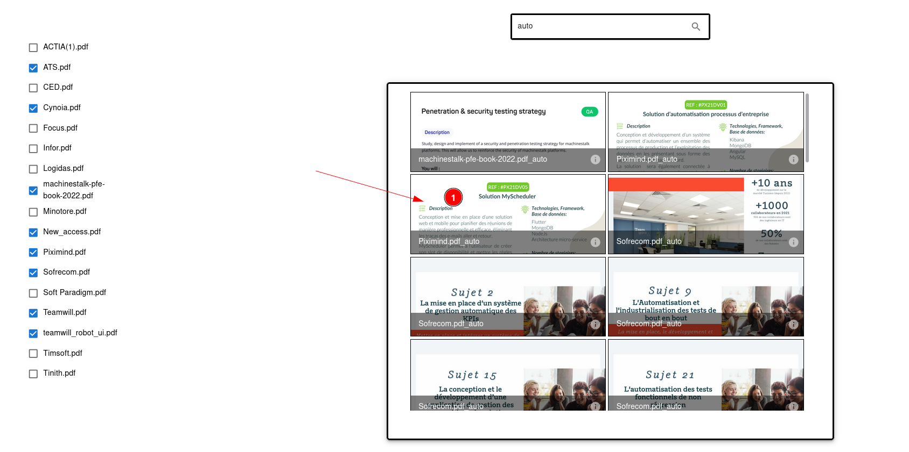
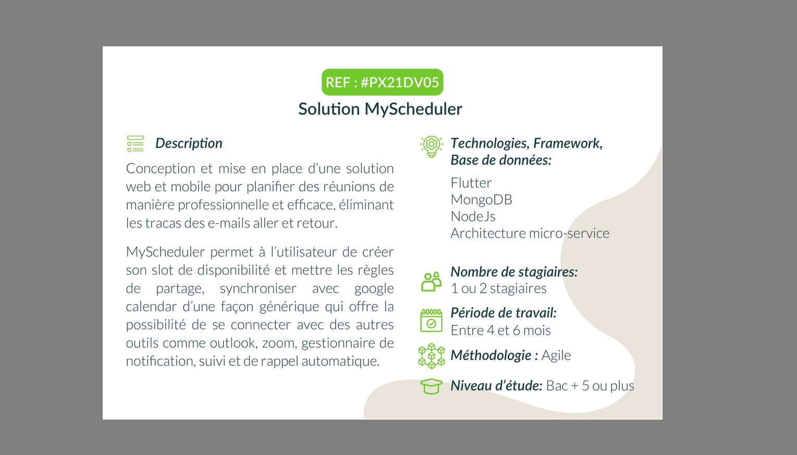

## How this works?
This part is the backend written with Django, and it interacts with a web Frontend written with React that will be linked down bellow

#### Step0
Drop your pdf files inside `assets` folder
#### Step1
Select files that you want to fuzz for keywords. Tap your keyword in the search bar, then click the search button

<p align="center" >
    
</p>

#### Step2
Scroll through results, then select an image that interests you

<p align="center" >
    
</p>

#### Step4
Look through the pdf page. (more control actions will be provided in the future)

<p align="center" >
    
</p>


## Setup
### Clone project

```
$ git clone https://github.com/HazemBZ/pdf_fuzz.git
```

### Install packages

```
$ cd pdf_fuzz
$ pip install -r requirements
```
(activating a virtual environment with tools like `pyenv` or `venv` is highly recommended)

### Run migrations then run server

```
$ python manager.py migrate
$ python manager.py runserver 8000
```

### Run web Frontend
Follow this [link](https://github.com/HazemBZ/pdf_fuzz_web.git)
